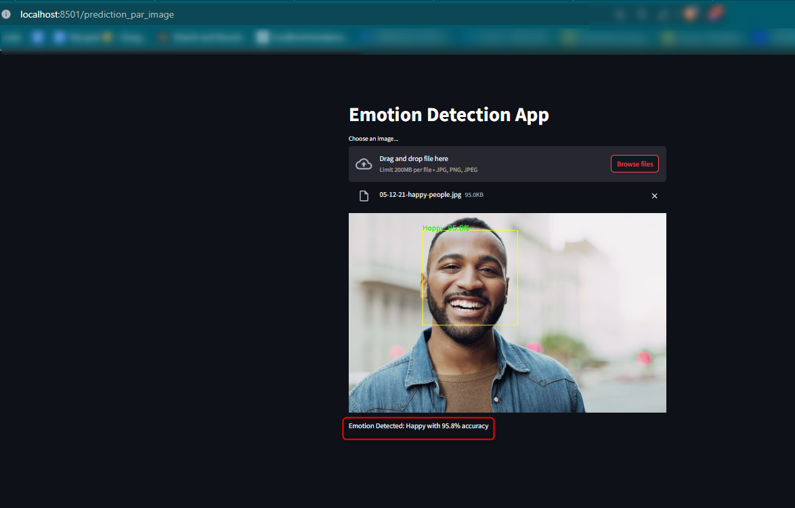
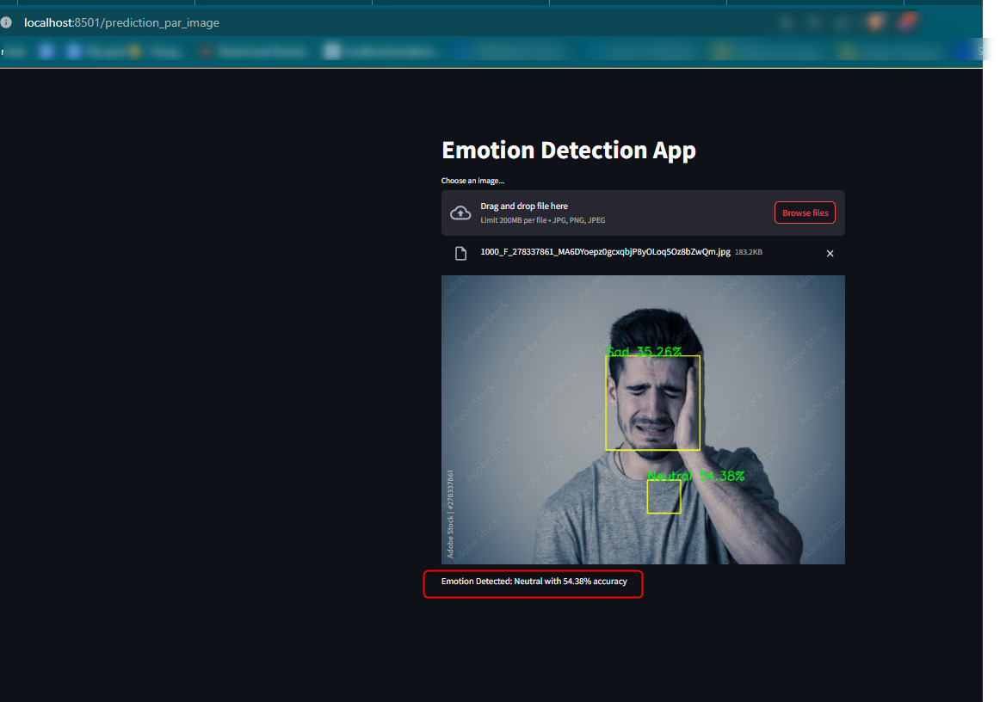
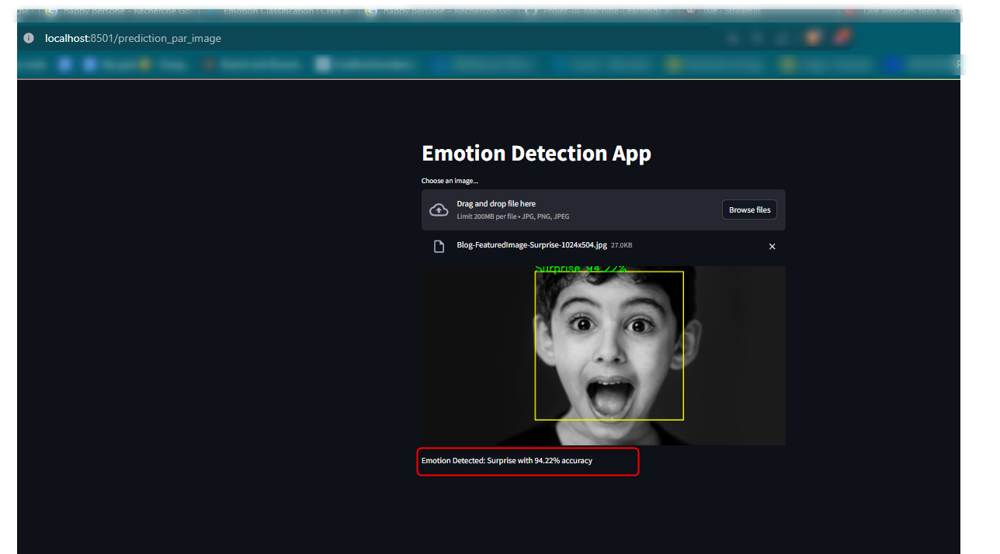

# Projet de Détection d'Émotion

## Description
Ce projet est une application de détection d'émotion qui utilise un modèle de réseau de neurones convolutionnels (CNN) construit avec Keras, une API de réseaux de neurones de haut niveau écrite en Python et capable de s'exécuter sur TensorFlow. L'application analyse les images fournies par l'utilisateur et détecte les émotions affichées par les personnes sur les photos, avec un niveau de précision indiqué.

### Webapp 

#### framework : 


#### bibliothèques : 

|      numpy      |     opencv      |      keras      |   tensorflow  |
| --------------- | --------------- | --------------- |---------------
|  |  |  | 


## Modèle CNN
Le modèle CNN a été entraîné pour reconnaître diverses émotions en utilisant un large ensemble de données d'images faciales. Le modèle identifie les émotions suivantes : colère, dégoût, peur, bonheur, neutralité, tristesse et surprise.


## Utilisation d'OpenCV
OpenCV est utilisé pour le traitement d'image préalable, y compris la conversion des images en niveaux de gris et la détection des visages avant de les passer au modèle de classification des émotions.

## Fonctionnalités Supplémentaires
L'application offre également la possibilité de détecter les émotions en temps réel via une webcam, en utilisant le même modèle de CNN.


#### Projet de Détection des Émotions

Ce projet utilise un modèle CNN (réseau de neurones convolutifs) conçu avec Keras et utilise OpenCV pour le traitement d'images en temps réel.

## Exemples de Prédiction

### Happy emotion avec 95.8% accuracy



### Sad emotion avec 46.54% accuracy



### Surprise emotion avec 94.22% accuracy




## Installation
Pour exécuter l'application, vous aurez besoin des bibliothèques suivantes :
- Keras
- OpenCV
- Numpy
- Streamlit (pour l'interface utilisateur web)

## Fichier de Requis (requirements.txt)
```
numpy==1.xx.x
opencv-python-headless==4.xx.x
streamlit==1.xx.x
keras==2.xx.x
tensorflow==2.xx.x
Pillow==8.xx.x
```
*Remarque : Remplacez "xx" par les numéros de version les plus récents et compatibles.*

## Exécution
Pour lancer l'application, utilisez la commande suivante :
```sh
streamlit run home.py
```

## Contribution
SAVOUNDIRAPANDIANE Muthuvel / Nabila EL ABDALI / Jihene BEN AMEUR / Claudia TIMOCI


